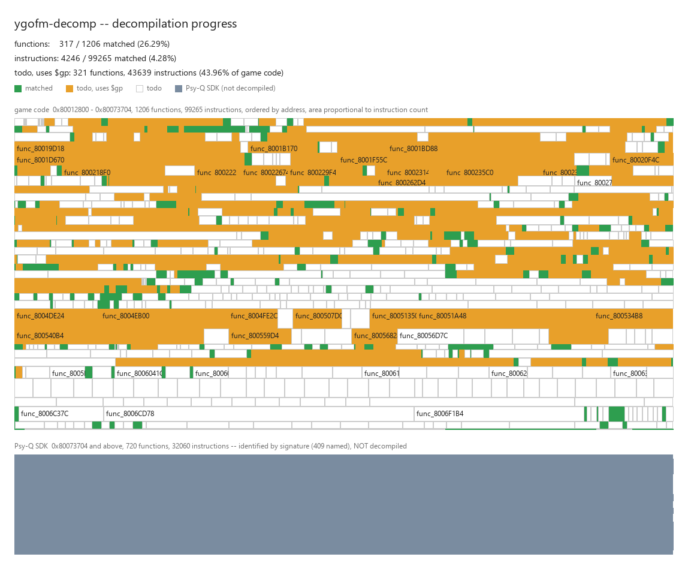

# ygofm-decomp

A matching decompilation of **Yu-Gi-Oh! Forbidden Memories** (PlayStation,
NTSC-U, `SLUS-01411`).

Every commit rebuilds the game executable **and the complete 517 MB disc image
byte for byte**. Functions that have been decompiled are compiled from C;
everything else is linked from extracted assembly. The result is bit-identical
either way, so the game is always playable and the SHA-1 is always the test.

```
SLUS_014.11    84747e64f6da8e764206ec203e489acf8c9dcf7d
disc image     d5785a41900a10968d4a28a390666c4b9879b796
```

**Nothing copyrighted is distributed here.** The disc, the extracted assembly
and data, and the Psy-Q SDK are all gitignored — you supply your own. See
[Requirements](#requirements).

## Progress



**Rectangle area is proportional to instruction count**, not one cell per
function. Green is decompiled and byte-matching, amber is still assembly and
addresses through `$gp`, white is still assembly, grey-blue is the Psy-Q SDK
region. Functions stay in address order, so the picture is a map of the
executable rather than a sorted chart.

The area weighting is not cosmetic. Function sizes in this binary span three
orders of magnitude: **37 of 678 game functions hold roughly 48% of the code**,
the largest single function is **10,376 instructions** against a mean of 147,
and a 6-instruction leaf on an equal grid looks exactly like a 400-instruction
state machine. Since the automated pass matches the *smallest* functions first,
an equal-cell map overstated progress by more than 10x. With area weighting the
coloured fraction of the image *is* the fraction of the game that is done.

Current status, from `py -3 tools/progress_map.py`:

| | total | matched | |
|---|---|---|---|
| game functions | 1,206 | **317** | 26.29% |
| game instructions | 99,265 | **4,246** | **4.28%** |

```
todo, uses $gp:   321 functions   43,639 instructions (43.96%)
todo:             568 functions
Psy-Q SDK:        720 functions   409 identified by signature, none decompiled
```

**Instructions matched is the number to watch.** The two metrics disagree by
more than 10x for the reason given above, and function count is the flattering
one.

One caveat on the concentration figure: `tools/split_funcs.py` found that
spimdisasm had merged 320 functions into 146 labelled spans (unlabelled code
continuing past a `jr $ra`), and 27 of the 37 "500+ instruction" functions were
containers of that kind. So the code is real but somewhat less concentrated in
single functions than the raw distribution suggests.

## Why byte-identity

Verifying reimplemented gameplay logic means playing the game, which does not
scale and cannot run unattended. Byte equality is the only cheap oracle: a
decompiled function either assembles to the same bytes as the original or it is
rejected. There is no "looks correct" failure mode and no drift.

This is not theoretical. A single wrong byte at `0x80092B73` — caused by data
lines in the disassembly omitting the raw-word field, so a `.short` was dropped
when the assembly was split — was caught by nothing except the hash.

The gate is also cheap enough to leave on: a full parallel rebuild takes about
3.4 seconds.

What the hash does *not* prove is that the tree describes the program
correctly. Twice a wrong claim survived it — most notably the Psy-Q crt0 at
`0x800129D8`, which splat emits as raw `.word` data rather than instructions.
The bytes are right, so the hash never complained. See [PLAN.md](PLAN.md).

## Requirements

* **Windows, or Docker.** The Psy-Q tools are 32-bit PE binaries and run
  natively under WOW64, which is the one place where Windows is genuinely
  easier than Linux for this work. Off Windows they run under Wine in a
  container — see [Building off Windows](#building-off-windows). The rest of
  the toolchain is native everywhere.
* **Python 3.12 or 3.13** (`py -3`). The bare `python` on PATH may be the
  Microsoft Store stub, which does not work.
* **Your own copy of the game disc**, as a `MODE2/2352` `.bin`/`.cue` pair
  (517,872,768 bytes, 220,184 sectors, single track). Not distributed.
* **Your own copy of the Psy-Q SDK**, releases 4.6 and 4.7. Proprietary SCE
  binaries; not distributed, and not redistributable.
* **Your own PlayStation BIOS** (`SCPH1001.BIN`), for the emulator-based tools
  only. Redux otherwise falls back to OpenBIOS, which is a reimplementation and
  not something to trust when the question is whether the real game boots.
* PCSX-Redux, for the boot test and the coverage/sampling tools.
* Optionally Ghidra and a JDK 21, for type and struct recovery. Both live under
  `tools/bin/` and are set up by `tools/ghidra_import.py`; nothing else needs
  them.

### Setup

```bash
git clone --recurse-submodules https://github.com/gonzaloberteri/ygofm-decomp
cd ygofm-decomp

py -3 -m venv .venv
.venv/Scripts/python.exe -m pip install splat64 spimdisasm rabbitizer pyelftools \
    colorama ansiwrap watchdog levenshtein n64img pygfxd tqdm intervaltree \
    pylibyaml pyyaml crunch64 pycparser pillow toml
```

`toml` is for `tools/permuter`, which imports it and fails at startup without it.

If you cloned without `--recurse-submodules`, run
`git submodule update --init --recursive`.

Then populate `tools/bin/`, which is gitignored and which you assemble yourself:

```
tools/bin/bin/mipsel-none-elf-{as,ld,objcopy,cpp,objdump}.exe
                                                    PSn00bSDK binutils 2.40
tools/bin/mkpsxiso-2.30-win64/{mkpsxiso,dumpsxiso}.exe   mkpsxiso 2.30
tools/bin/psyq/p46/Psy-Q - 46/BIN/CC1PSX.EXE        Psy-Q 4.6 (also INCLUDE/)
tools/bin/psyq/p47/psyq-4_7-converted/lib/          Psy-Q 4.7, ELF-converted
tools/bin/redux/pcsx-redux.exe                      PCSX-Redux (Windows x64)
tools/bin/redux/SCPH1001.BIN                        your own BIOS dump
```

The binutils bundle is PSn00bSDK's `gcc-mipsel-none-elf-12.3.0-windows.zip`,
which unzips straight into `tools/bin/` with the `bin/` subdirectory already in
the right place. PCSX-Redux has no tagged releases; the Windows build is the
`dev-win-x64` continuous build.

Psy-Q 4.7's libraries are additionally used by `tools/psyq_sigs.py`, because
neither release is a superset of the other — the game links 4.6's `libgpu/font`
and 4.7's `libds`.

## Building

```bash
py -3 tools/all.py                                  # everything
py -3 tools/all.py --no-boot                        # skip the emulator
py -3 tools/extract_disc.py "path\to\game.bin"      # if the disc is elsewhere
```

**Where the disc is.** `extract_disc.py` looks for
`Yu-Gi-Oh! Forbidden Memories (USA).bin` next to the repository, because the
disc is yours and there is nothing portable to default to. Anywhere else, pass
the path — or set `YGOFM_DISC`, which is what `all.py` needs, since it invokes
`extract_disc.py` with no argument:

```bash
set YGOFM_DISC=C:\path\to\Yu-Gi-Oh! Forbidden Memories (USA).bin   # cmd
$env:YGOFM_DISC = 'C:\path\to\...'                                 # PowerShell
export YGOFM_DISC='/path/to/...'                                   # sh
```

`all.py` runs the whole pipeline: extract the disc, classify regions, generate
the splat config, split, compile, link, verify, rebuild the image, verify again,
render the progress map. It exits non-zero the moment the output stops being
byte-identical.

### Building off Windows

Exactly one part of the pipeline is Windows-only, and it is not negotiable:
`CC1PSX.EXE` is a 32-bit Windows PE, it is the compiler whose output is being
reproduced byte for byte, and there is no native build of it. Recompiling an
equivalent GCC 2.95.2 from source would defeat the point — the project's claim
is that *this* compiler emits *these* bytes. So off Windows it runs under Wine.

It does **not** run under emulation. [`wibo`](https://github.com/decompals/wibo)
is a small Win32 loader — not an emulator — that maps the PE and calls into it,
so on an Apple Silicon Mac the x86 code goes through Rosetta 2 in-process. This
is what decomp.me uses for the same compiler.

Everything else is portable and now resolves through `tools/toolchain.py`,
which picks the right filename for the host and attaches the loader when one is
needed. Setup, then a report of what was found:

```bash
tools/setup_unix.sh
python3 tools/toolchain.py
```

`setup_unix.sh` fetches `wibo` and builds **binutils 2.40 for
`mipsel-none-elf`** from source. Both pins are deliberate. Homebrew's
`mipsel-linux-gnu-binutils` is 2.46 and a *hosted* target triple, where this
tree wants bare-metal at the version it was developed against — assembler
defaults are exactly the kind of thing that silently moves bytes. There is no
macOS PSn00bSDK bundle to unzip, which is why this builds rather than
downloads.

You still supply the proprietary half yourself: the Psy-Q SDK, the disc, and a
BIOS if you want the boot test.

#### Why not Docker, and why not Wine

Both work, and both are much slower. Measured on an M4 with the same 32-bit
test binary:

| | Docker `linux/amd64` + Wine | **wibo, native** |
|---|---|---|
| start-up per invocation | 256 ms | **30 ms** |
| benchmark loop | ~2.7 s | **0.25 s** |

The trap is that the container *looks* accelerated. Docker Desktop registers
Rosetta for x86-64 ELF but falls back to QEMU for i386 — and `wine32` is an
i386 ELF, so the compiler quietly runs under QEMU while everything around it
runs at full speed. `tools/docker/` is kept for a reproducible Linux
environment and uses `wibo` too; it is not the recommended path on a Mac.

`tools/toolchain.py` also honours three overrides, for a host that keeps things
elsewhere: `YGOFM_BINUTILS`, `YGOFM_WINE`, `YGOFM_CC1`.

One known difference to watch: decomp.me pipes preprocessed source through
`unix2dos` before handing it to `CC1PSX.EXE`. Line endings reaching a 1990s
Windows compiler are a plausible source of divergence, and this tree does not
currently normalise them.

**A result from a non-Windows host is not authoritative.** Whether Wine's
`CC1PSX.EXE` is byte-for-byte identical to the same compiler under WOW64 is an
empirical question about a proprietary binary, and the answer has to be *shown*
on this tree, not assumed. Until `tools/verify_src.py` has been run on both and
agreed, treat a container match as a candidate and re-verify it on Windows.

`tools/build.py` alone is the fast inner loop and prints:

```
  OK  byte-identical to the original SLUS_014.11
```

The disc rebuild reproduces the original image's SHA-1. Where it cannot —
mkpsxiso regenerates ECC/EDC and the volume descriptor timestamps — the gate
falls back to comparing the content of all nine files individually, which must
match exactly.

## The emulator, and the save states

Everything that runs the game — `verify_boot.py`, `trace.py`, `sample.py` — uses
**PCSX-Redux**, and only Redux. It is the choice because of its Lua API: the
coverage and sampling tools are Lua scripts driving the emulator from inside,
which is not something DuckStation can do. Keeping a second emulator around for
the boot test alone meant two installs and two incompatible save-state formats
for no benefit, so the boot test was moved over as well.

Four save states are needed, captured by hand in the Redux GUI and shared by all
three tools:

```
tools/states/SLUS01411.sstate1    in-game start menu
tools/states/SLUS01411.sstate2    name input screen
tools/states/SLUS01411.sstate3    first duel deck build menu
tools/states/SLUS01411.sstate4    in a duel          <- the acceptance target
```

They are needed because the boot path never reaches a duel on its own, and no
controller input is scripted. To capture them, open `build/ygofm.bin` in the
Redux GUI with the real BIOS, play to each point, and use *File → Save state
slots → Save slot N*.

Redux resolves slot filenames against its **persistent directory**, not the
working directory, so they land in `%APPDATA%\pcsx-redux\` — the same place it
keeps `memcard1.mcd`. Copy them into `tools/states/` afterwards:

```bash
copy "%APPDATA%\pcsx-redux\SLUS01411.sstate*" tools\states\
```

Restoring never happens during BIOS init — the tools boot for a warmup period
first, because loading a state while the kernel is still setting up leaves the
emulator with nothing running and no further Vsync ever arrives.

### Measuring what a restored state actually runs

A restored state with no controller input runs the game's **idle loop**, so the
duel's real logic never executes. `tools/pad.lua` scripts input to get past that;
pass `--pad` to `trace.py` or `sample.py`.

Two traps are worth stating, because both produce confident-looking nonsense:

* **Sampling aliases.** `sample.py` samples once per Vsync, always at the same
  phase of the frame, so a 16-instruction wait-spin takes ~98.8% of samples
  whether or not input is being driven. It is a hotness ranking, not coverage,
  and it cannot tell you whether input changed anything. Use `trace.py`, where a
  function is either hit or not.
* **Arming every breakpoint at once does not finish.** All 1206 cost ~4–10 s per
  frame under the interpreter — and the interpreter is the only mode that
  observes breakpoints at all. `--batch N` arms N per pass, sweeps the game in
  several passes and merges the hits, which is affordable because a save state
  skips the boot.

## Toolchain

Recovered by search rather than assumption, with `tools/flagsweep.py`, since
none of it is documented anywhere public:

| | |
|---|---|
| compiler | `CC1PSX.EXE` — GCC **2.95.2** (build 4.0), from Psy-Q 4.6 |
| assembler | ASPSX **2.86**, reproduced by [maspsx](https://github.com/mkst/maspsx) |
| linker | `mipsel-none-elf-ld`, with a generated script pinning every region to its exact VMA |

### Flags vary per translation unit

There is no single command line that reproduces this binary. Three knobs vary
independently per file:

* **`opt`** — the optimisation level. **`-O2` dominates**, `-O1` is common, and
  at least one function (`func_800136D4`) was built with **no `-O` at all**;
  only `-O0` produces its bare `addiu $sp,-16` / `addiu $sp,16` / `jr $ra` /
  `nop`. Across the 74 hand-decompiled files that carry their own flags: 57
  `-O2`, 15 `-O1`, 1 `-O3`, 1 with no `-O`. An earlier claim in PLAN.md that
  the build used `-O3` throughout was based on two tiny functions and is
  retracted.
* **`as_G`** — the *assembler's* `-G`, which decides whether a small-symbol
  reference is emitted as `offset($gp)` or as a `%hi/%lo` pair. This is a
  separate knob from the compiler's: turning `as -G8` on globally *breaks*
  functions that legitimately use `%hi/%lo` for a symbol small enough to have
  been gp-addressed.
* **`cc1_G`** — the compiler's `-G`, which decides which objects are *eligible*
  for the small-data area. With `cc1_G=0` GCC emits its own `lui`/`%lo` pair;
  with `cc1_G=8` it emits the `lw $r,sym` assembler macro, and the two allocate
  registers differently. Corollary: cc1 never allocates `$at`, so `$at` in the
  original proves an assembler macro rather than compiler output.

Flags live next to the code they describe, as a comment on the first line of
each file, read by `tools/cc.py`:

```c
/* decomp-flags: opt=-O2 as_G=8 cc1_G=0 cc1_extra=-fno-schedule-insns2 expand_div=1 */
```

`cc1_extra` names an individual pass, because no `-O` level reproduces some
functions. `expand_div` turns on ASPSX's two-guard division macro, which GCC
never emits itself -- see PLAN.md.

Keeping them in the file rather than in a shared JSON is what lets parallel
workers run without contending on one config. `config/cflags.json` holds the
default and the machine-generated entries for `src/auto/`.

## Layout of the binary

```
0x80010000 .. 0x80012800   data (the image opens with a jump table, not .text)
0x800129D8 .. 0x80012B50   Psy-Q crt0
0x80012B50 .. 0x80073704   Konami game code      ~397 KB   <- the target
0x80073704 .. 0x80092C00   Psy-Q libraries       ~128 KB   identified, not decompiled
0x80092C00 .. 0x801E0000   data, and 1.09 MB of zero fill
$gp = 0x8009AF08           set by the crt0 at 0x80012A54
```

The 1.86 MB executable is 71.6% zero fill, and the SDK accounts for another
128 KB. Successive corrections took the real target from 1.86 MB (raw file) to
525 KB (code only) to **397 KB of code Konami actually wrote** — about 99,265
MIPS instructions.

The Psy-Q region is identified rather than decompiled, by relocation-masked
signature match against the real library objects: the mask comes from each
object's own relocation table, so every field the linker would have patched is
excluded and everything else must be identical. There is no similarity
threshold to tune. **99.33% of the SDK code is identified and the residual is
fully accounted for.** The genuine libraries are deliberately *not* linked; the
reasoning is in [PLAN.md](PLAN.md).

## Repository layout

```
config/           region map, splat config, symbol addresses, per-file flags
include/          types, macros, the generated assembler includes
linker_scripts/   the base linker script
src/manual/       hand-decompiled functions, one per file
src/auto/         functions matched by the unattended m2c pass
src/*.c           globals and early hand-written units
tools/            the pipeline (see below)
tools/bin/        gitignored: binutils, mkpsxiso, Psy-Q. Supply your own.
```

Three tools are git submodules:

| submodule | points at |
|---|---|
| `tools/maspsx` | [gonzaloberteri/maspsx](https://github.com/gonzaloberteri/maspsx), branch `extern-small-data-nop` |
| `tools/asm-differ` | [simonlindholm/asm-differ](https://github.com/simonlindholm/asm-differ), upstream |
| `tools/m2c` | [matt-kempster/m2c](https://github.com/matt-kempster/m2c), upstream |
| `tools/permuter` | [gonzaloberteri/decomp-permuter](https://github.com/gonzaloberteri/decomp-permuter) |

The maspsx fork carries one patch, and it is load-bearing. Upstream learns
which symbols live in the small-data area only from `.sdata` blocks and
`.comm`/`.lcomm` — that is, from objects *defined in the same translation
unit*. Decompiled code references the game's globals as `extern`, for which cc1
emits `.extern sym, size`, so those were never recognised as small and the
load-delay `nop` was never forced. Meanwhile gas, given `-G8`, addressed them
gp-relative anyway. The two ends disagreed and every affected function came out
one word short per load/use pair — which made any function whose body is a
chain of `lhu $v0,off($gp); nop; sh $v0,off($gp)` unmatchable for tooling
reasons rather than source reasons. The patch honours the size operand of
`.extern`, which is exactly the test gas itself applies.

## Tools

| tool | purpose |
|---|---|
| `all.py` | run the whole pipeline |
| `extract_disc.py` | pull the 9 files out of the MODE2/2352 image, record SHA-1 baselines |
| `stage_iso.py` | stage `iso/` and the LBA-pinned `config/disc.xml` with dumpsxiso |
| `find_boundary.py` | locate `.text`/`.data` in the flat payload by structural scoring |
| `map_regions.py` | classify every 1 KB window as code / data / zero |
| `gen_splat_config.py` | emit `config/splat.yaml` from the region map |
| `build.py` | compile, assemble, link, and verify against the original |
| `split_asm.py` | carve the disassembly around functions that now exist in C |
| `split_funcs.py` | find functions the disassembly merged, and emit labels to split them |
| `make_iso.py` | rebuild the disc image with the original LBAs |
| `verify_boot.py` | hash gate plus a PCSX-Redux smoke test from a save state |
| `trace.py` | breakpoint coverage under PCSX-Redux, optionally from a save state; `--batch N` sweeps in cheap passes and merges |
| `sample.py` | PC-sampled hotness ranking, optionally from a save state |
| `pad.lua` | scripted controller input, so a restored state runs real logic instead of its idle loop (`--pad` on either tool) |
| `cc.py` | compile one C file the way the original build did |
| `match.py` | compare a compiled file against the original, per function |
| `flagsweep.py` | search the flag space for what makes a file match |
| `psyq_sigs.py` | identify Psy-Q SDK functions by relocation-masked signature |
| `psyq_lib.py` | native `LIB`/`LNK` archive reader, for 4.6's unconverted libraries |
| `psyq_residual.py` | account for every unmatched byte of the SDK region; compare releases |
| `gen_context.py` | build a Psy-Q type/signature context for m2c |
| `ghidra_import.py` | import `SLUS_014.11` into Ghidra at `0x80010000` with our function names |
| `ghidra_decomp.py` | decompile one function out of that project, for type/struct recovery |
| `autodecomp.py` | run m2c → compile → compare unattended, keep what matches |
| `funcs.py` | function inventory and candidate selection |
| `progress_map.py` | render `progress.png` (deterministic — no timestamps, everything sorted) |
| `tu_detect.py`, `tu_own.py` | propose translation-unit boundaries (both still too weak to trust) |

## Contributing

The loop is short and the gate is absolute.

```bash
py -3 tools/funcs.py --candidates       # pick a target
py -3 tools/match.py src/manual/foo.c   # compile and compare, per function
py -3 tools/flagsweep.py src/manual/foo.c   # when it does not match, search the flags
py -3 tools/build.py                    # whole-binary SHA-1 gate
```

Rules:

1. Iterate on `tools/match.py` until it prints `MATCH` for every function in
   the file. **Never commit a file that does not match.** A non-matching file
   either breaks the build or, worse, silently stops the tree from describing
   the program.
2. Then run `tools/build.py` and confirm `OK byte-identical`. `match.py`
   compares only `.text`, so a function dispatching through a jump table can
   report `MATCH` while its jump table lands at the wrong address. Only the
   whole-binary hash catches that.
3. Record the flags in the file's `decomp-flags` comment, not globally.
4. If a function genuinely cannot be matched, say so in the commit message
   rather than committing something approximate.

Notes that recur, collected in [PLAN.md](PLAN.md): GCC 2.95 inverts `if`
conditions; `sll/sra 16` at entry means the parameter was `s32`, not `s16`;
two induction variables in the assembly means two pointer variables in the
source; `i[array]` instead of `array[i]` flips which register accumulates an
address; the `$gp` hardware-state words need `volatile`.

## What is not done

* **Translation-unit boundaries are not reconstructed.** Two heuristics have
  been tried and both are too weak to trust — `tu_detect.py` proposes 111
  boundaries with a median implied unit of 4 functions, where real units are
  far larger. This no longer *blocks* matching (`R_MIPS_GPREL16` plus a
  `_gp` definition in the linker script dissolved that), but the source tree is
  one file per function instead of the `src/<programmer>/<module>.c` layout the
  original used.
* **The disassembly merges 320 functions** into 146 labelled spans, because
  spimdisasm only starts a function where it has a reason to.
  `tools/split_funcs.py` detects these conservatively, but the inventory still
  overstates sizes and understates the function count wherever they have not
  been split out.
* **The boot test is a smoke test, not a frame comparison.** It loads an
  in-duel save state on the rebuilt image and checks that the game keeps
  delivering Vsyncs. That is sufficient while the build is byte-identical, and
  becomes load-bearing only when a function is ever accepted as
  equivalent-but-not-identical. It counts frames rather than checking that the
  process is alive, because a hung emulator stays alive — the DuckStation
  version of this check would have passed a black screen.
* **Unedited m2c output is exhausted.** Widening the candidate pool from 80 to
  250 instructions and sweeping six flag combinations bought exactly one extra
  function. `size-differs` is ~49% of failures, which is per-function structure
  recovery — types, struct layouts, signedness — not a flag search.
* **Data is still `.incbin`'d.** The card database, fusion table, drop tables
  and text are raw blobs, not named C structures.
* **The Psy-Q region is linked as extracted assembly**, by design rather than by
  omission.

## Credits

This project is mostly glue around other people's tools:

* [splat](https://github.com/ethteck/splat) and
  [spimdisasm](https://github.com/Decompollaborate/spimdisasm) — disassembly and
  segmentation
* [maspsx](https://github.com/mkst/maspsx) — reproduces ASPSX behaviour on top
  of GNU as
* [m2c](https://github.com/matt-kempster/m2c) — MIPS to C decompiler
* [asm-differ](https://github.com/simonlindholm/asm-differ) — side-by-side
  assembly diffs
* [mkpsxiso](https://github.com/Lameguy64/mkpsxiso) — LBA-pinned CD image
  rebuild
* [PSn00bSDK](https://github.com/Lameguy64/PSn00bSDK) — the `mipsel-none-elf`
  binutils build
* [DuckStation](https://github.com/stenzek/duckstation) — the boot test

Structure and tooling patterns follow
[sotn-decomp](https://github.com/Xeeynamo/sotn-decomp),
[NFSHS-PSX-decomp](https://github.com/Caesar0007/NFSHS-PSX-decomp) and
[open-spyro](https://github.com/theMagicalKarp/open-spyro).

The Forbidden Memories data-format community removed a great deal of guesswork
about the asset side: [fmlib-cpp](https://github.com/forbidden-memories-coding/fmlib-cpp),
[fmscrambler](https://github.com/forbidden-memories-coding/fmscrambler),
[YGOFM-BGEx](https://github.com/xan1242/YGOFM-BGEx) and
[FM-Manip-Tool](https://github.com/GenericMadScientist/FM-Manip-Tool).

## License

The tooling, configuration and documentation in this repository are original
work and are released under the [MIT License](LICENSE).

That licence covers `tools/`, `config/`, `include/`, `linker_scripts/` and the
documentation. It does **not** cover:

* the decompiled C under `src/`, which is derived from the original game and is
  a work of reverse engineering — it carries whatever status the original does,
  and no licence is granted for it here;
* `tools/maspsx`, `tools/asm-differ` and `tools/m2c`, which are git submodules
  carrying their own upstream licences.

Yu-Gi-Oh! Forbidden Memories is © Konami. This project is not affiliated with
or endorsed by Konami or Sony Interactive Entertainment. No game code, game
data, disc image or SDK binary is distributed here, and none ever will be: you
must supply your own legally obtained copies. Nothing in this repository is
usable without them.
